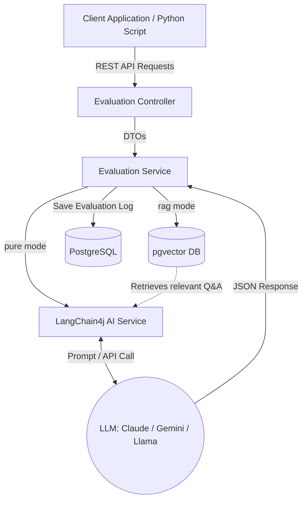

# MockBean
> An AI-powered "LLM-as-a-Judge" REST API designed for automated evaluation of technical interview answers. By integrating multiple large language models via varying approaches (RAG vs Pure Prompts), the system provides detailed scorings, minimizing human bias and recruitment time.
>
> *Note: This project was originally developed as an academic research assignment for the "Computational Intelligence" course, exploring the viability of LLM evaluations compared to human recruiters.*

[API Specification / Swagger UI](http://localhost:8080/swagger-ui.html)

## Engineering Highlights & Architecture Decisions
*This section highlights architectural decisions over basic CRUD operations.*

* **LLM Pattern Implementation:** Dynamic switching between RAG (Retrieval-Augmented Generation) and Pure Prompts using `LangChain4j` and Spring Profiles. This setup allows seamless swapping between Claude, Gemini, and Llama 3.1 without modifying business logic.
* **Vector Search Integration:** Utilized PostgreSQL with the `pgvector` extension for semantic answer retrieval. Answers are converted into vectors using locally hosted `nomic-embed-text` embeddings.
* **Database Evolution:** Schema and seed data are strictly managed via version-controlled migration scripts (`Flyway`) — disabling risky auto-DDL features in Spring.
* **Evaluation Observability:** Every LLM response is persisted in the database as an `EvaluationLog`, enabling downstream statistical analysis regarding the model's accuracy and "gullibility" against adversarial inputs.

## Tech Stack
* **Language / Framework:** Java 21 + Spring Boot 3.5.x
* **Data Layer:** PostgreSQL (with `pgvector` for vector storage) + Spring Data JPA
* **AI Integration:** LangChain4j, Ollama (local models execution)
* **Testing:** JUnit 5, Testcontainers (PostgreSQL integration)
* **DevOps:** Docker, Docker Compose, Flyway

## Architecture & System Design
*The application employs a unified Service Layer connected to LangChain4j AI Service interfaces, hiding the complexities of diverse LLM APIs from the Presentation Layer. This ensures high cohesion and testability.*



## Getting Started

**Prerequisites:** Docker, local Java 21 environment, Maven, and Ollama (if using local models).

```bash
# Clone the repository
git clone <repository-url>
cd <project-directory>

# 1. Start the PostgreSQL database equipped with pgvector
docker compose up -d

# 2. Start the application (Default profile uses local Llama 3.1)
# Note: Ensure you pulled models beforehand: `ollama pull llama3.1` and `ollama pull nomic-embed-text`
./mvnw spring-boot:run
```

For executing via external APIs, pass the corresponding profile and API keys as environment variables:
`export ANTHROPIC_API_KEY=your_key` and `./mvnw spring-boot:run -Dspring-boot.run.profiles=claude-sonnet-4-6`.

## Testing & Quality Assurance

* **Integration tests:** The database layer and context loading are verified via `Testcontainers`, spinning up ephemeral PostgreSQL instances to guarantee reproducible pipeline states. 

```bash
# Command to run the test suite
./mvnw clean test
```

## What I'd Improve With More Time

1. **Fully Asynchronous Processing:** Introduce an event-driven mechanism (e.g., Spring `@Async` or Kafka) to return a correlation ID immediately, as LLM API responses can take considerable time.
2. **Caching:** Implement response caching (e.g., Redis or Caffeine) based on query hashes to limit unnecessary API requests and costs for identically phrased user answers.
3. **Structured Error Handling:** Introduce a global `@RestControllerAdvice` to consistently format LLM timeout exceptions or embedding failures so that clients get unified HTTP error payloads.

## Report
Report & Presentation are available in the 'report' folder.

## License
MIT
